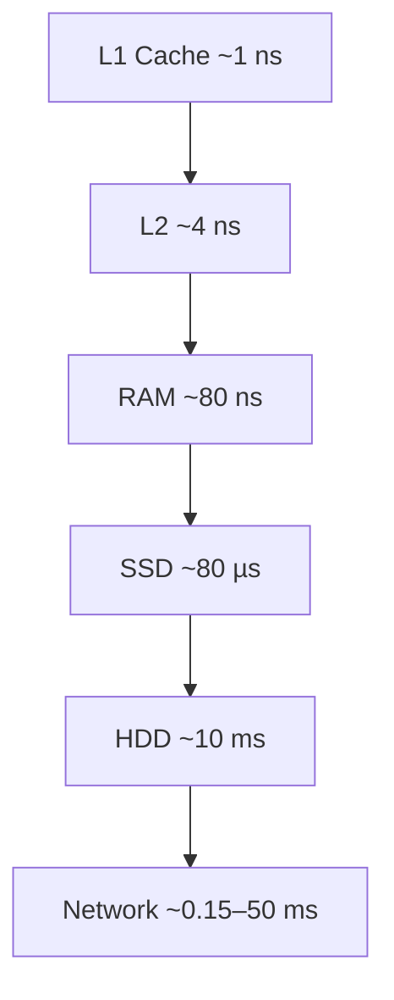
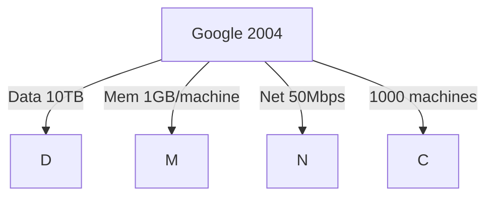

Awesome—let’s build App 1 for Model 1: The Memory Hierarchy Bottleneck.

App name
- Physics Chooses: The Memory Ladder

Purpose
- Make the memory hierarchy visceral and quantitative.
- Show why data size vs memory size forces multi-pass, streaming designs.
- Connect the inequality to real runtimes and cluster-scale consequences.

Primary learning outcomes
- Read a latency “ladder” (ns → ms) and grasp 10–10,000x gaps between levels.
- Compute minimum passes from Data/Memory and see how it explodes with scale.
- Translate latency/throughput numbers into wall-clock time for tasks.
- Recognize what can fit where: algorithm in L1, working set in L2, chunk in RAM, dataset on disk/network.

Target audience
- Practitioners, students, and PMs—no distributed systems expertise assumed.

Narrative arc (scenes)
- S0. Setup: Your hardware reality
- S1. Time at scale: The latency ladder
- S2. Capacity vs speed: What fits where
- S3. The Impossibility Calculator: Minimum passes
- S4. Consequences: How long would that actually take?
- S5. Case study: Google 2004 numbers
- S6. Reflection & quiz: What does this force?

Core interactions and visuals

S0. Setup: Your hardware reality
- Controls (left panel):
  - Data size slider: 1 MB → 10 PB (log scale)
  - Memory per machine slider: 256 MB → 1 TB
  - Machines: 1 → 10,000
  - Block size: 4 KB → 256 MB
  - Disk type: HDD/SSD (changes latency/throughput)
  - Network per machine: 10 Mbps → 100 Gbps
- Presets:
  - Google 2004, Cloud 2024, Laptop 2025
- Output (top bar):
  - Working set ratio = Memory/Data
  - Minimum passes = ceil(Data/Memory) for “needs-entire-dataset-in-RAM” algorithms
  - Suggested class: streaming vs external-memory required vs in-memory OK

S1. Time at scale: The latency ladder
- Visualization: A vertical log-scale “time ruler” from 1 ns to 10 s with pins:
  - L1: ~1 ns; L2: ~4 ns; RAM: ~60–100 ns; NVMe SSD: ~50–100 µs; HDD: ~10 ms; Network: 150 µs–50 ms
- Interactions:
  - Hover any pin → “If L1 = 1 second, then HDD would be ~months” analogy
  - Toggle unit normalization: CPU cycles, seconds, distance-on-screen
  - Switch “hardware profile” to see pins shift
- Teaching copy:
  - Annotate 10–10,000x jumps between each level
  - Explain why you can’t collapse this ladder with software

S2. Capacity vs speed: What fits where
- Visualization: Pyramid or nested boxes with each level labeled by typical capacity and access time (live from S0).
- Draggable “working set” and “chunk”
  - Drag a “data structure” (e.g., hash table 500 MB) to see which level can hold it.
  - AI helper hints: “This fits in RAM but not in cache; you’ll thrash L2”
- Callouts:
  - Algorithms live in L1/L2
  - Working set ideally in L2/L3
  - Current chunk in RAM
  - Whole dataset in SSD/HDD/network

S3. The Impossibility Calculator: Minimum passes
- Equation pane:
  - Passes_min = ceil(DataSize / EffectiveMemory)
  - EffectiveMemory = MemoryPerMachine × min(Concurrency, Machines)
  - Concurrency = floor((DiskBW or NetBW) / InputRateBound) bound by CPU and I/O; defaults to Machines for intuition
- UI:
  - Toggle “single machine” vs “cluster” mode
  - Inputs: Data size, Memory per worker, Concurrency, Algorithm class:
    - Needs-all-in-RAM (e.g., in-memory sort)
    - External-memory-friendly (streamable)
- Output visuals:
  - Big counter: “Minimum passes required: 10,000”
  - Bar chart: passes vs memory size (sweep memory slider and see passes collapse)
  - Alternate view: “Memory multiplier” required for 1-pass target
- Notes:
  - For streamable algorithms, 1 “pass” may suffice but the cost is paid in sequential I/O—sets up Model 2 later.

S4. Consequences: How long would that actually take?
- Calculator:
  - Runtime ≈ (Passes × DataSize) / EffectiveThroughput
  - EffectiveThroughput per machine (read or write): min(DiskBW, NetBW if remote)
  - Cluster throughput ≈ sum of node-local throughputs, capped by network fabric if off-rack (educational approximation)
- Scenario cards:
  - In-memory impossible: e.g., 10 TB / 1 GB → 10,000 passes; show naive in-memory attempt is absurd
  - External mergesort: show approximate passes ~ log base (M/B) with formula preview (no deep dive—teased for Model 5)
- Visualization:
  - Stacked timeline segments showing per-pass time; hover to see which level dominates
- Slider:
  - Turn on compression (2–5x), observe impact as bandwidth-bound layers dominate

S5. Case study: Google 2004 numbers
- Pre-filled: Data=10 TB, RAM=1 GB, Network=50 Mbps, Disk=100 MB/s, Machines=1,000
- Visual:
  - Ladder pins plus “You are here” markers
  - Animated “pass count” comparing strategies:
    - Naive in-memory: 10,000 passes (unbounded)
    - External memory streaming: ~1–2 passes per job stage
  - Bar: moving code (1 MB) vs data (1 TB): time and bytes (previews Model 3)
- Outcome:
  - “Physics forces streaming + external memory algorithms”

S6. Reflection & quiz
- Short quiz (interactive cards):
  - If you double memory per machine, how do passes change?
  - Why does fitting the working set in cache change performance by orders of magnitude?
  - What two numbers tell you if an algorithm must be external-memory? (Data size, Available memory)
- “What this forces” callout:
  - Must design external-memory algorithms
  - Minimize passes
  - Prefer sequential access (tease Model 2)

Data, formulas, and modeling details

Canonical constants (editable via profile)
- L1: 1 ns; L2: 4 ns; RAM: 80 ns
- SSD random read: 80 µs; HDD random read: 10 ms
- Disk sequential throughput: HDD ~150 MB/s; SSD ~2–6 GB/s
- Network per machine: 50 Mbps (2004), 10 Gbps (2018), 100 Gbps (2024)

Key equations
- Min passes (needs-all-in-RAM class):
  - passes_min = ceil(DataSize / (MemoryPerWorker × ConcurrentWorkers))
  - Single machine intuition: passes_min ≈ ceil(DataSize / Memory)
- Wall time per pass (per machine):
  - t_pass ≈ DataPerWorker / min(DiskSeqBW, NetBW_if_remote)
- Cluster pass time:
  - t_cluster_pass ≈ max(max_per_worker_time, fabric_congestion_time)
- External mergesort pass count (preview only):
  - passes ≈ 1 + ceil(log_{M/B}(n/B))
- Analogy scaler:
  - map(ns → s) to show “1 ns → 1 s” then show others relative

UI components and states

Layout
- Left: Controls (hardware/data/algorithm)
- Center: Main visualization (ladder/pyramid/timeline depending on scene)
- Right: Explanations, numbers, and quiz or hints
- Top: Presets and “Path” breadcrumb (S0–S6)
- Bottom: Notebook drawer (users save snapshots of configs and export as PNG/SVG)

Visual components
- Log-scale time ruler (D3)
- Pyramid nested boxes showing capacity vs speed
- Multi-panel calculator with live math (inline LaTeX rendering)
- Scenario timeline (stacked bars)
- Hover tooltips with analogies and unit conversions

Accessibility
- Keyboard navigation for sliders; large touch targets
- Descriptive alt text for each level and relationship (“L1 is ~80x faster than RAM”)
- Color-blind-safe palette; haptic cues optional on mobile

Copy and micro-teaching moments
- “You don’t beat the ladder; you route around it.”
- “If it can’t fit, it must stream.”
- “Every extra pass multiplies total I/O—minimize passes.”

Sample content strings (for localization)
- “Your dataset is X times larger than memory. Minimum passes: Y.”
- “At these settings, the disk dominates; improving network won’t help.”

Gamified challenges
- Challenge 1: Make “in-memory only” possible without changing data size (answer: increase memory or reduce algorithmic requirement)
- Challenge 2: Keep accuracy, halve runtime—what knob helps? (reduce passes via better algorithm class)
- Challenge 3: Fit the working set in L2 by changing input batch size

Analytics and instrumentation
- Track:
  - Time spent per scene
  - Range of data sizes explored
  - Common misconceptions (e.g., users maxing network to fix disk-bound scenarios)
- A/B tests:
  - Ladder-first vs calculator-first onboarding
  - Analogies: time vs distance scaling impacts retention

Tech stack (suggested)
- Frontend: React + TypeScript
- Visualization: D3 + Canvas for the ladder, SVG for pyramid; MathJax/KaTeX for formulas
- State: Zustand/Redux
- Exports: SVG/PNG snapshot
- Optional: WebAssembly module for performance modeling if we add richer simulators later

Data model (TypeScript)
- HardwareProfile {
    name: string;
    cache: { L1: ns; L2: ns; L3?: ns };
    ram: { latencyNs: number };
    storage: { type: 'HDD'|'SSD'; randReadUs: number; seqMBps: number };
    network: { perMachineMbps: number; rttUs: number };
  }
- Scenario {
    dataBytes: number;
    memoryPerMachineBytes: number;
    machines: number;
    blockSizeBytes: number;
    algorithmClass: 'inMemoryRequired'|'streamable'|'externalSort';
  }

Mermaid mockups to communicate the core visuals

Latency ladder (S1)


Passes calculator (S3)
```mermaid
flowchart LR
  D[(Data Size)] --> DIV[/÷/]
  M[(Effective Memory)] --> DIV
  DIV --> P{{Minimum Passes = ceil(D / M)}}
```

Timeline consequence (S4)

```mermaid
gantt
  dateFormat  X
  title Passes vs Time (relative units)
  section Passes
  Pass 1 :p1, 0, 1
  Pass 2 :p2, 1, 1
  Pass 3 :p3, 2, 1
```


Case study setup (S5)


Onboarding flow (micro)
- Step 1: Pick profile → watch ladder pins animate
- Step 2: Drag “dataset” up/down the pyramid; see where it can reside
- Step 3: Enter memory per machine → instant ‘passes’ calc
- Step 4: See wall-time; try changes until the time drops 10x
- Step 5: Lock learning with a 3-question quiz

Integration points to next model
- “Notice sequential access wins even when both hit the same disk—open Model 2 to see why.”
- “External memory patterns appear because passes explode—see Model 5.”

Deliverables I can provide next
- UX wireframes for S1–S4
- Sample dataset for presets (2004/2012/2024)
- Copy deck for tooltips and quizzes
- D3 prototypes for ladder and passes calculator

Want me to draft the wireframes and the exact copy for S1–S3, or jump straight to Model 2’s app design next?