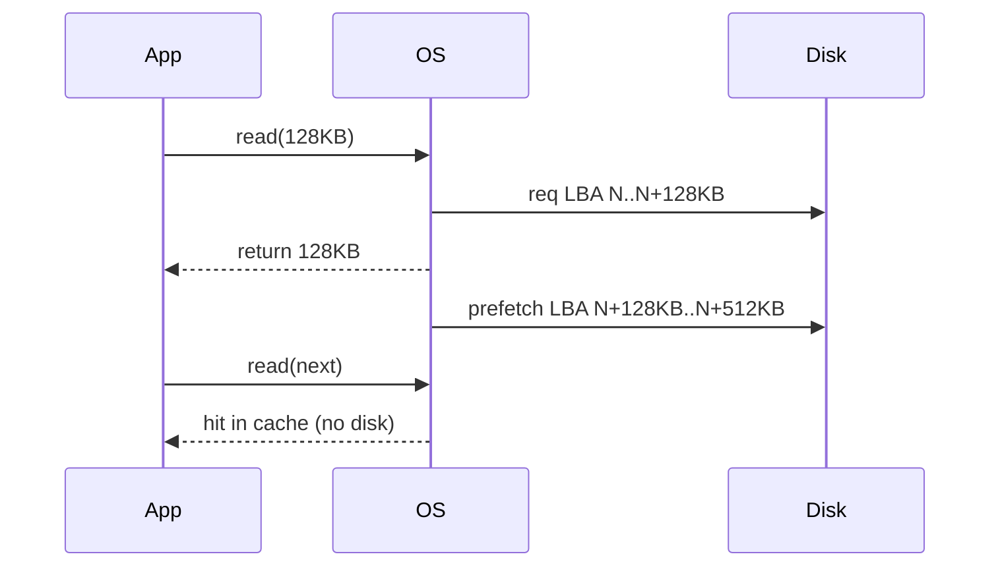
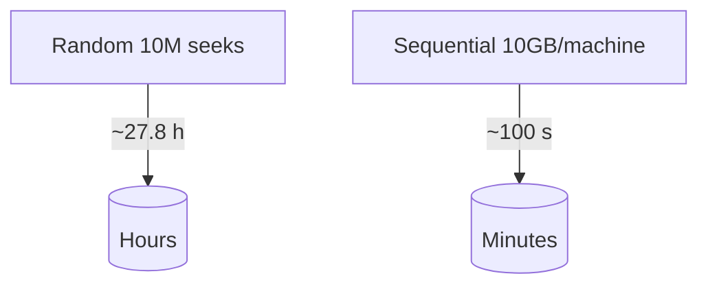
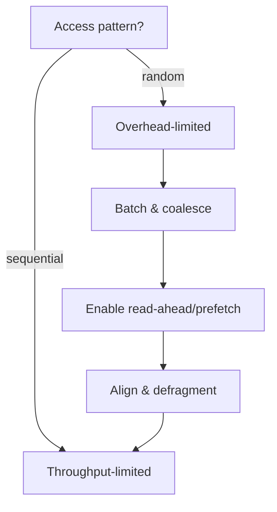
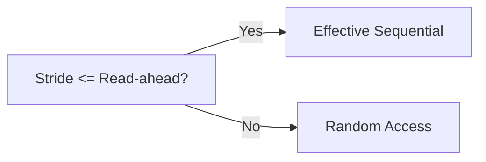
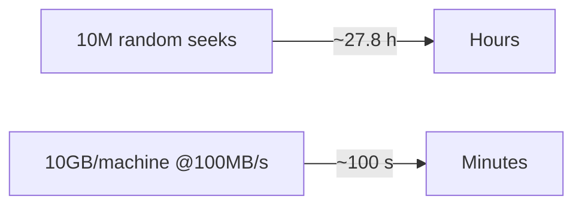
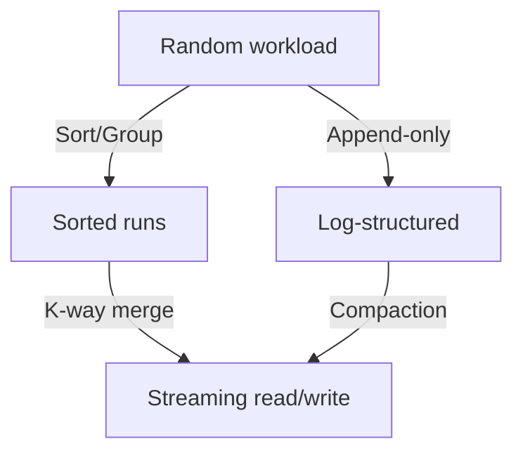

Awesome—App 2 is all about making “Sequential > Random” visceral, measurable, and actionable.

App name
- Stream or Die: The Sequential Edge

Purpose
- Show why sequential access is 100–1000x faster than random on HDDs (and still 5–20x on SSDs).
- Dissect the stack: mechanical, electrical, OS, and application-level effects compounding the advantage.
- Teach concrete tactics to convert random patterns into sequential streams.

Primary learning outcomes
- Decompose an I/O into seek, rotation, and transfer and compute time.
- See how read-ahead, prefetch, and batching change the game.
- Understand queue depth, I/O size, and access pattern impacts across HDD, SATA SSD, NVMe.
- Design workloads and data layouts that stream.

Target audience
- Engineers, students, PMs; no storage background assumed.

Narrative arc (scenes)
- S0. Profile setup: Your device + OS knobs
- S1. One I/O under a microscope
- S2. Random vs sequential race (single device)
- S3. Read-ahead, prefetch, and page cache
- S4. Batching and amortization economics
- S5. Stride, fragmentation, and alignment
- S6. Cloud/network angle: One stream vs many small RPCs
- S7. Cluster-scale case study (Google 2004)
- S8. Patterns that enforce sequential (append-only, LSM, columnar)
- S9. Quiz + scenario builder (apply it)

Core interactions and visuals

S0. Profile setup: Your device + OS knobs
- Controls (left panel):
  - Device: HDD (7200 RPM), SATA SSD, NVMe SSD
  - Seek (ms), rotation (ms), sequential BW (MB/s), random IOPS (for SSD)
  - I/O size: 4 KB → 1 GB (log slider)
  - Queue depth (QD): 1 → 128
  - OS read-ahead window: 0 KB → 1 MB
  - App buffering: 0 KB → 1 GB
  - Access pattern: random, sequential, strided(kB), fragmented(%)
  - Network mode toggle (off / 1 Gbps / 10 Gbps / 100 Gbps)
- Presets:
  - HDD_2008, SATA_SSD_2016, NVMe_2024
- Output badges:
  - Dominant cost: seek/rotation | transfer | syscall/RTT
  - Advantage now: Sequential is X× faster than random

S1. One I/O under a microscope
- Visualization: Stacked timeline dissecting a single read:
  - Seek (green), Rotation (amber), Transfer (blue), Syscall/context switch (gray)
- Tooltips: Editable values; show t_random = t_seek + t_rotation + size/BW + t_syscall
- Compare devices:
  - HDD: Seek ~5–10 ms, Rot ~4.2 ms (7200 RPM), Transfer varies
  - SATA SSD: Seek ~0.08 ms, Rot ~0, Transfer 500 MB/s
  - NVMe: Seek ~0.02 ms, Transfer 2–6 GB/s
- Micro-copy:
  - “Even on SSDs, small random reads waste controller cycles and PCIe round trips.”

Mermaid (single I/O dissection)

```mermaid
gantt
  dateFormat  X
  title Single I/O Breakdown (relative time)
  section HDD Random 64KB
  Seek        :a1, 0, 10
  Rotation    :a2, 10, 4
  Transfer    :a3, 14, 0.5
  section HDD Sequential 64KB
  Transfer    :b1, 0, 0.5
```


S2. Random vs sequential race (single device)
- Race sim: Animate two runners consuming 10 GB:
  - Random 4 KB blocks: limited by IOPS
  - Sequential 1 MB blocks: limited by throughput
- Graph: Throughput vs I/O size, curves for random vs sequential
- Numeric outcomes:
  - HDD example: Random 100 IOPS × 4 KB ≈ 0.4 MB/s; Sequential ≈ 150 MB/s ⇒ ~375×
  - NVMe example: Random 100k IOPS × 4 KB ≈ 400 MB/s; Sequential 3 GB/s ⇒ ~7.5×
- Toggle queue depth to show SSD’s parallelism benefit, HDD’s limited gain.

S3. Read-ahead, prefetch, and page cache
- Visualization: Sliding “read head” with OS read-ahead window shaded ahead.
- Interaction:
  - Increase read-ahead from 0 to 512 KB → watch random-stride become smooth if stride ≤ window.
  - Toggle app prefetch (background reads) and see pipeline fill reduce waits.
- Teach:
  - If stride > read-ahead → still random.
  - Page cache turns repeated access into RAM-speed (but only if working set fits).
  - O_DIRECT bypasses cache—use carefully.

Mermaid (sequence of read-ahead pipeline)


S4. Batching and amortization economics
- Calculator:
  - Without batching: 1 record → 1 I/O → cost ≈ 10 ms (HDD) each
  - With 100 MB buffer: write 1M records in 1–2 I/Os → amortized cost/record plummets
- Visualization: Bar showing cost/record vs batch size; knee points highlighted
- Play:
  - Drag “batch size” slider; see speedup curve plateau when transfer dominates
  - Memory budget line warns when you starve parallelism (tie to Model 7 later)
- Formula:
  - cost_per_record ≈ (t_overhead + size_batch/BW) / records_per_batch

S5. Stride, fragmentation, and alignment
- Stride explorer:
  - Set stride (KB). If stride ≤ read-ahead window → effective sequential
  - If not, throughput drops toward random
- Fragmentation dial:
  - 0–100%: number of extents per GB; visualize jagged head jumps
- Alignment gauge:
  - Misaligned I/O causes read-modify-write penalties; highlight in red
- Output:
  - Effective throughput and IOPS under current stride/fragmentation/alignment

S6. Cloud/network angle: One stream vs many small RPCs
- Side-by-side:
  - One HTTP range GET streaming 1 GB
  - 10,000 GETs × 100 KB
- Controls:
  - RTT (ms), HTTP/2 multiplexing on/off, persistent connections, QUIC toggle
- Output:
  - Total wall-clock time; bytes on wire fairly equal, but RTT tax dominates small reads
- Teach:
  - The “sequential beats random” rule applies to networks via RTT and head-of-line blocking.

Mermaid (RPC vs stream)
```mermaid
flowchart LR
  A[Client] -- Single stream --> S[(Server)]
  A2[Client] .. multiple small RPCs ..> S
  note bottom of A2: Each call pays RTT + headers
```

S7. Cluster-scale case study (Google 2004)
- Pre-filled:
  - HDD 100 MB/s, Network 50 Mbps/machine, 10 TB dataset, 1000 machines
- Scenarios:
  - Random 10M seeks × 10 ms = ~27.8 h (seek-only) + transfer
  - Sequential per machine: 10 TB / 1000 = 10 GB → 10 GB / 100 MB/s = 100 s → ~1.6 min cluster
- Visualization: Stopwatch comparison; “physics chose sequential”
- Tie-in:
  - Streaming turns bottleneck from seeks to pure bandwidth, enabling parallelism.

Mermaid (race result)


S8. Patterns that enforce sequential
- Pattern cards (interactive, with toggles):
  - Append-only logs and log-structured merge (LSM) trees
  - Columnar formats (Parquet/ORC) and predicate pushdown
  - External merge sort (runs + k-way merge)
  - Write-ahead logging and group commit
- Each card shows:
  - “Before” random access → “After” sequentialized
  - Trade-offs (compaction, read amplification)
  - Where it’s used (databases, Kafka, HDFS, MapReduce)

Mermaid (LSM write path)
```mermaid
flowchart LR
  MUT[MemTable] --> WAL[(Append-only WAL)]
  MUT --> SST0[Flush -> SSTable (seq)]
  SST0 --> COMPACT{Compaction}
  SST1[SSTable seq] --> COMPACT
  COMPACT --> SSTn[New SSTable seq]
```

S9. Quiz + scenario builder
- Quiz examples:
  - Q: HDD, 4 KB random, 100 IOPS—how long for 10 GB? A: ~7 hours. Show work.
  - Q: What read-ahead rescues a 64 KB stride? A: ≥64 KB window.
  - Q: On NVMe, random 4 KB @ 100k IOPS vs sequential 3 GB/s—what’s the ratio? A: ≈7.5×.
- Scenario builder:
  - “Turn this random workload into sequential within 2× memory budget.”
  - Users choose batching, read-ahead, data layout, and see pass/fail.

Data, formulas, and modeling details

Core formulas
- HDD random read time (one I/O):
  - t = t_seek + t_rotation + size / BW + t_sys
- HDD average rotation (7200 RPM):
  - t_rotation ≈ 60,000 ms / 7200 / 2 ≈ 4.17 ms
- Random throughput (HDD):
  - thr ≈ IOPS × size; IOPS ≈ 1 / (t_seek + t_rotation + controller)
- Sequential throughput:
  - thr ≈ device_seq_bw × utilization_factor
- SSD random:
  - IOPS governed by controller, parallelism, and QD; use preset curves per device
- Read-ahead effectiveness:
  - if stride ≤ read_ahead_window → effective sequential
  - else random; partial benefit if stride within 2× window (interpolate)
- Network:
  - Many small RPCs time ≈ N × (RTT + payload/BW_app)
  - Single stream time ≈ total_payload / BW_app (after warm-up)

Canonical presets
- HDD_2008: seek 9 ms, rot 4.2 ms, seq 120 MB/s, IOPS 120
- SATA_SSD_2016: rand read 0.08 ms, seq 500 MB/s, 60k IOPS
- NVMe_2024: rand read 0.02 ms, seq 3 GB/s, 100k IOPS (QD=1), 700k IOPS (QD=32)
- Network RTT: 1 ms (intra-DC), 40 ms (inter-region); BW: 1–100 Gbps

UI components and states

Layout
- Left: Controls (device, OS, app)
- Center: Primary visual for current scene (timeline, race, curves)
- Right: Explainers, computed numbers, hints
- Top: Presets and scene breadcrumb
- Bottom: “Make it sequential” toolbox with pattern cards

Visual components
- Stacked I/O timeline (D3, Canvas)
- Throughput vs I/O size curves with QD toggle
- Read-ahead visualizer
- Race animation (10 GB random vs sequential)
- Scenario builder with validation and tips

Accessibility
- Keyboard-driven sliders, labeled controls
- Alt text: “Random 4KB on HDD is dominated by 14ms overhead; sequential 1MB is dominated by 6.7ms transfer.”
- Color-blind friendly (distinct hues + textures)
- Reduced motion mode (turn off animations)

Copy and micro-teaching moments
- “Random pays a tollbooth every record. Sequential pays once and cruises.”
- “Read-ahead turns polite patterns into streams—help your OS help you.”
- “Batching converts syscalls into megabytes.”
- “SSD narrows the gap; it never closes it.”

Gamified challenges
- Challenge 1: HDD, 10 GB, 4 KB records. Achieve <3 minutes. Solution: batch to ≥1 MB, enable 512 KB read-ahead, align to 1 MB.
- Challenge 2: NVMe, inter-region RTT 40 ms. Cut time 5× without more bandwidth. Solution: stream in one request, increase app buffers, HTTP/2 persistent connection.
- Challenge 3: Strided scan at 64 KB stride. Tune read-ahead to make it “effectively sequential.”

Analytics and instrumentation
- Track:
  - Patterns used to “sequentialize”
  - Time spent in each scene
  - Most changed knobs (batch size, read-ahead)
- Detect misconceptions:
  - Users crank QD on HDD → Suggest: “Queue depth doesn’t cure mechanics on spindles.”

Tech stack (suggested)
- Frontend: React + TypeScript
- Viz: D3 + Canvas (timelines, curves), SVG (diagrams), Lottie (light animations)
- Math: KaTeX for formulas
- State: Zustand/Redux
- Export: SVG/PNG snapshots; shareable scenario URLs
- Optional: WebAssembly module to simulate SSD queue/latency curves accurately

Data model (TypeScript)
- DeviceProfile {
    name: 'HDD'|'SATA_SSD'|'NVMe';
    seekMs?: number; rotationMs?: number;
    seqMBps: number;
    randIOPS_QD1: number;
    randIOPS_QD32?: number;
  }
- OSProfile {
    readAheadKB: number;
    pageCacheMB: number;
    alignmentKB: number;
  }
- Workload {
    totalBytes: number;
    ioSizeKB: number;
    queueDepth: number;
    accessPattern: 'sequential'|'random'|'strided';
    strideKB?: number;
    fragmentationPct?: number;
    batchBytes: number;
  }
- NetworkProfile {
    enabled: boolean;
    rttMs: number;
    bandwidthGbps: number;
    http2: boolean;
    persistent: boolean;
    quic: boolean;
  }

High-impact Mermaid snippets

Random vs sequential Gantt (S1/S2)


Throughput decision flow (S4)


Read-ahead effectiveness (S3)


Cluster case study (S7)


Patterns that enforce sequential (S8)


Onboarding flow
- Step 1: Pick your device profile → watch the single I/O dissection animate.
- Step 2: Run the 10 GB “race” → see 100×–1000× spread on HDD, 5×–20× on SSD/NVMe.
- Step 3: Turn on read-ahead and batching → watch the random curve bend toward the sequential ceiling.
- Step 4: Apply sequentializing patterns in the scenario builder and hit a target runtime.
- Step 5: Lock learning with 3 quiz questions; show personalized “cheat sheet” recommendations.

“Make it sequential” toolbox (actionable cheats)
- Batch records to ≥1 MB I/O
- Align I/O to device/page size
- Use append-only/LSM-style writes
- Sort/group by access key before processing
- Enable/size OS read-ahead; prefetch next chunk
- Prefer streaming APIs (range reads, persistent connections)
- Avoid small synchronous syscalls; use async I/O

Integration points to next models
- To Model 5 (External Memory Algorithms): “You can’t fit it; you must stream. External mergesort is the canonical sequentializer.”
- To Model 7 (Buffering/Spilling): “Batch sizes and in-memory buffers are your throttle.”
- To Model 3 (Bandwidth Inequality): “If the network is 16× slower than disk, moving code to data is the only way to keep it sequential end-to-end.”

Want me to draft wireframes and the exact calculator math for S2–S5, or jump to Model 3’s app design next?